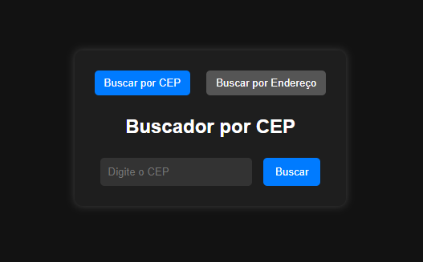

# Buscador de CEP e Endereço

Este é um projeto simples de buscador de CEP e endereço utilizando a API do [ViaCEP](https://viacep.com.br/). O usuário pode buscar informações de endereço a partir de um CEP ou encontrar um CEP com base em um endereço.



## 📌 Funcionalidades
- **Busca por CEP**: O usuário digita um CEP e recebe informações sobre o logradouro, bairro, cidade, estado e o próprio CEP.
- **Busca por Endereço**: O usuário digita UF, cidade e logradouro para obter o CEP correspondente.
- **Validação de dados**: Verifica se os campos foram preenchidos corretamente.
- **Mensagens de erro**: Alerta o usuário caso ocorra algum erro na busca.

## 🛠️ Tecnologias Utilizadas
- HTML
- CSS
- JavaScript
- API [ViaCEP](https://viacep.com.br/)

## 🚀 Como Executar o Projeto
1. Clone este repositório:
   ```bash
   git clone https://github.com/mikelj917/Buscador-de-CEP.git
   ```
2. Acesse a pasta do projeto:
   ```bash
   cd buscador-cep
   ```
3. Abra o arquivo `index.html` no navegador.

## 📜 Estrutura do Projeto
```
/
├── index.html         # Estrutura principal da página
├── src/
│   ├── css/
│   │   ├── styles.css   # Estilos do projeto
│   ├── js/
│   │   ├── script.js    # Lógica principal do buscador
```

## 📌 Como Funciona
1. O usuário digita um CEP e clica no botão "Buscar".
2. O JavaScript faz uma requisição `fetch` para a API ViaCEP.
3. Se a resposta for válida, os dados são exibidos na tela.
4. Se ocorrer um erro, uma mensagem de alerta é mostrada.
5. O usuário pode buscar um novo CEP clicando no botão "Nova Busca".

## 📎 Exemplo de Uso
Para buscar o CEP "01001-000":
```bash
https://viacep.com.br/ws/01001000/json/
```
Retorno esperado:
```json
{
  "cep": "01001-000",
  "logradouro": "Praça da Sé",
  "complemento": "lado ímpar",
  "bairro": "Sé",
  "localidade": "São Paulo",
  "uf": "SP",
  "ibge": "3550308",
  "gia": "1004",
  "ddd": "11",
  "siafi": "7107"
}
```

## 📄 Licença
Este projeto está sob a licença MIT - veja o arquivo [LICENSE](LICENSE) para mais detalhes.